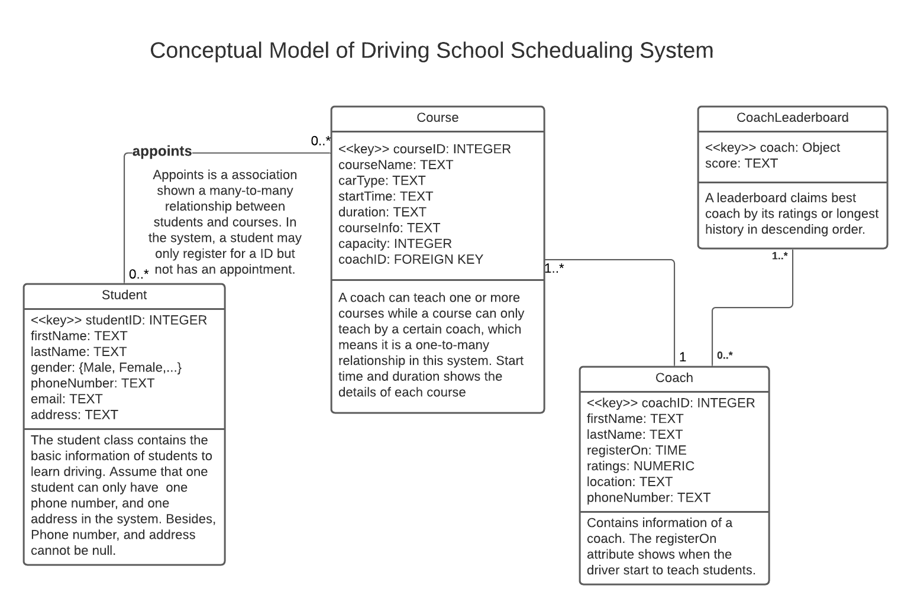

## Using it

1) Clone the repo
2) Install the dependencies

```
npm install
```
3) Import& init database

```
mongorestore /dump
node db/init.js
```

4) Start the server

```
npm start
```

5) Point your browser to http://locahost:3000

## Requirement

Design a scheduling application for a driving school. 

Students of the driving school need to appoint online. More specifically, students need to find a suitable courses and have an appointment in the system. Each student can have zero or more reservations because a student can only register in the system and find a coach without an appointment. A course can be selected by zero or more students. Besides, each course has a certain coach and one coach can teach for many courses. To maitain the quality of the courses, it is best for a coach not to teach more than 5 courses.

The application also needs to store all information of students, courses and coaches. 

Firstly, students should sign with their first name, last name, gender. Moreover, each student could have one email address, and must have one phone number in the system, or the coaches cannot communicate with their students. Most importantly, the address is necessary for students because a coach needs to pick up students at a specific location. 

Secondly, the application needs to show coaches' first name, last name, phone number and the time they register on a coach. To help students make a better choice, it needs to show the ratings of coaches. Besides, location is also necessary for a student to find a suitable coach near home. 

Thirdly, the information of courses need to be shown. A course will have a name (maybe driving lesson: DLXXX). In addition, a car type name to help student find the specific type of car they would like to learn. Start time and duration tells the specific time to start the course and how long it will take. Capacity shows the maximum students in a certain course. Great with a short introduction. Finally, the coach of the course.

New Feature:

Leaderboard for all the Coaches in our Drive School, ranking by the best ratings they got or the longest teaching history.

## Functionalities that switched or added as Redis database:

1) Best coaches with the highiest ratings, descending sorted
2) Coaches with longest teaching history, descending sorted
3) Create/Read/Update/Delete Coach data using Redis
4) Initialize data and import data into Redis database from local Mongodump backup

## Datastructure
1) Using Ordered Set to store and sort Best Coaches by its attributes
2) Using Hash to store Coach information for Create/Read/Update/Delete functions(eg. name, phoneNumber, ratins, etc.)
3) Using List to store current active Coach IDs for Create/Read/Update/Delete functions(Query Coach information from Hash)
4) Using a String to hold current boundary of ID for coaches, supports Create function
5) Using Hash,List,String (the same as Create method) for initializing original data


## Architecture

